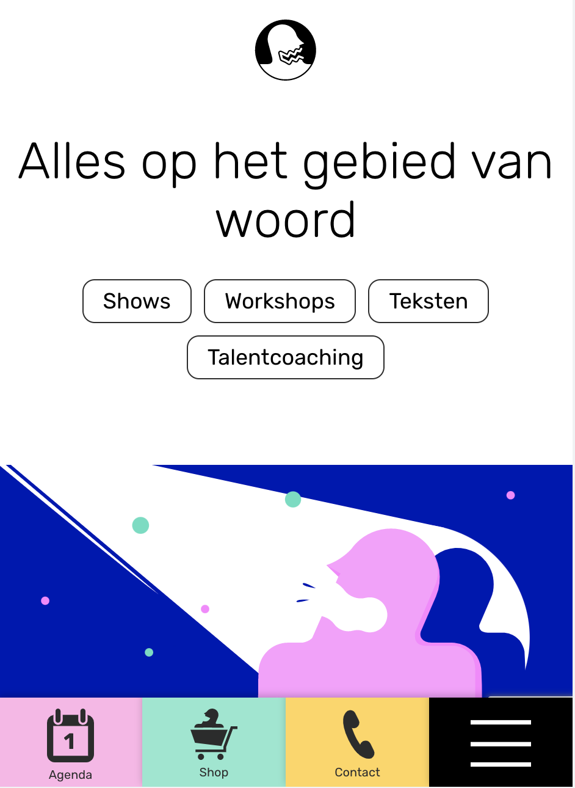

# Procesverslag
Markdown is een simpele manier om HTML te schrijven.  
Markdown cheat cheet: [Hulp bij het schrijven van Markdown](https://github.com/adam-p/markdown-here/wiki/Markdown-Cheatsheet).

Nb. De standaardstructuur en de spartaanse opmaak van de README.md zijn helemaal prima. Het gaat om de inhoud van je procesverslag. Besteedt de tijd voor pracht en praal aan je website.

Nb. Door *open* toe te voegen aan een *details* element kun je deze standaard open zetten. Fijn om dat steeds voor de relevante stuk(ken) te doen.

## Jij

  
uitwerken voor kick-off werkgroep

  ### Auteur:
  Kyra Maloney

  #### Je startniveau:
  blauw

  #### Je focus:
  het responsive maken 
 

## Je website

  
uitwerken voor kick-off werkgroep

  ### Je opdracht:
 <a>https://mensenzeggendingen.nl/</a>

  #### Screenshot(s) van de eerste pagina (small screen): 
  hier de naam van de pagina  
  

  #### Screenshot(s) van de tweede pagina (small screen):
  hier de naam van de pagina  
  
 

## Toegankelijkheidstest 1/2 (week 1)

  
uitwerken na test in 1e werkgroep

  ### Bevindingen
  Lijst met je bevindingen die in de test naar voren kwamen:
  - heel veel gebruik van classes
  - veel gebruik van divs
  - gebruik van een menu onderin voor mobiel scherm, wat eigenlijk niet vaak voor komt.
  - veel a img's 
  - veel buttons

  #### Screenreader
  
  
  
  - alles in de hele wesite wordt voorgelezen 
  - enige is dat je het gene moet selecteren als je het voorgelezen wilt hebben.

  #### Muis en Toetsenbord 
  
  - de website ik makkelijk met de muis te gebruiken, veel scroll opties, veel klik opties.
  - je kan met de tap op het toetsenbord gemakkelijk door de gehele website waar alle 'a' en 'buttons' zijn.
  - in de settings is er een optie om ook het lettertype groter te maken zodat mensen het beter kunnen lezen.
  

  #### Motoriek (shocks, elastiekjes)
  
  - ik heb met de elastiekjes gewerkt en ik had veel moeite om uberhaupt mijn laptop te besturen, dus bij mij lukte het ook minimaal om de website te besturen.

 

  #### Visueel (brillen, contrast, kleurenblind, dark/light). 

  
  - hierboven in de image zie je dat er een optie is voor kleurenblinden mensen, hierbij worden er andere kleuren aangegeven op de website die die mensen wel kunnen zien.
  - verder heb ik met de brillen getest, hierbij kwam eruit dat op deze website het lettertype heel goed word weergegeven, het lettertype is namelijk heel erg duidelijk, en groot.
  - ook zijn de kleuren erg duidelijk. de kleuren die voornamelijk worden gebruikt zijn wit, zwart, grijs, oker geel, roze, en navy blue.
  

## Breakdownschets (week 1)

  
uitwerken na afloop 2e werkgroep

  ### de hele pagina: 
  

  ### dynamisch deel (bijv menu): 
  

 

## Voortgang 1 (week 2)

  
uitwerken voor 1e voortgang

  ### Stand van zaken
 - het begin erg goed ik ben begonnen met de 'wat wij doen' website. ik had een beetje moeite met de navigatie in het begin, maar gelukkig   heb ik daar hulp bij gekregen. verder was het plaatsen van de content best makkelijk bij deze website, ik heb hierbij veel flexboxen gebruikt om de styling mooi te maken.

  ### Agenda voor meeting
  samen met je groepje opstellen

  | jelle aanstoot   
  -  Mijn homepage heeft hun instagram feed geïntegreerd in hun homepage
  Ik wil weten hoe ik dit kan toevoegen aan mn website, of hoe ik dit het beste kan oplossen
  | lot van hagen    
  -  ik wil het iig hebben over de afstand van mijn tekst en hoe ik mijn afbeeldingen eruit kan laten zien als tegels want dat lukt mij niet. Ik struggle heel erg met de css maar mijn html is wel af.    
  | sanne oosterhof 
  -   Ik wil te weten komen of mijn HTML klopt en het semantisch is, zodat ik later mijn CSS hier niet voor hoef aan te passen 
  | kyra maloney  
  - Ik wil graag weten hoe ik de witregels van de tekst zou kunnen aanpassen en in mijn website heb je ook een soortvan buttons maar die zijn heel raar geplaatst dus ik wil ook weten hoe ik die op die manier moet plaatsen
 

  ### Verslag van meeting
  hier na afloop snel de uitkomsten van de meeting vastleggen

  - meerder nav in de header
  - eerder h2 gebruiken dan h1
  - flex direction --- row
  - witregels maken door margin en padding

## Voortgang 2 (week 3)

  
uitwerken voor 2e voortgang

  ### Stand van zaken
  - deze week heb ik nog veel gedaan aan de eerste pagina van mijn website. ik heb er voor gezorgt dat alles goed op ze plek staat en dat alles mooi gestijlt is. ik had deze week een beetje moeite met mijn tweede pagina beginnen, want ik wist niet hoe ik de tweede pagina zou moeten aangeven in css. ik heb uiteidelijk wel een begin gemaakt aan mijn tweede pagina. ik heb allebei de pagina's een aparte class gegeven zodat ik allebei de pagina's kan aanspreken in de css.

  ### Agenda voor meeting
  samen met je groepje opstellen

  | jelle aanstoot   
  - in de footer van mijn website staat een heading, welke h1/h2/h3 geef ik deze mee?
  | lot van hagen    
  -  Afbeeldingen als tegels
  - Afstand van de tekst
  - Of de HTML helemaal klopt     
  | sanne oosterhof 
  - Of de HTML helemaal klopt  
  - Header in het wit ipv roze?  
  - Linkjes apart stylen met een class?
  - Moet de achtergrond hetzelfde
  | kyra maloney  
  - hoe ik de twee pagina apart kan houden in de css.
 
 

  ### Verslag van meeting
  hier na afloop snel de uitkomsten van de meeting vastleggen

  - classes gebruiken om dingen aan te geven in css
  - divs mogen gebruiken om dingen te stijlen
  - nth:of-type-(2) gebruiken het aanspreken van het tweede van iets

## Toegankelijkheidstest 2/2 (week 4)

  
uitwerken na test in 8e werkgroep

  ### Bevindingen
  - gebruik van groot lettertype 
  - veel kleur
  - overzichtelijk 
  - veel witruimte

  #### Screenreader
  - alles in de hele wesite wordt voorgelezen 
  - enige is dat je het gene moet selecteren als je het voorgelezen wilt hebben.
  
  #### Muis en Toetsenbord 
  - de website ik makkelijk met de muis te gebruiken, veel scroll opties, veel klik opties.
  - je kan met de tap op het toetsenbord gemakkelijk door de gehele website waar alle 'a' en 'buttons' zijn.

  #### Motoriek (shocks, elastiekjes)
  - ik heb deze week met de shock dingen gewerkt, dit was erg lastig omdat mijn hand de hele tijd rare bewegingen maakte waardoor ik moeilijk mijn computer kon besturen. maar door de screenreader kom ik wel de hele pagina lezen en luisteren.

  #### Visueel (brillen, contrast, kleurenblind, dark/light). 
 - hierboven in de image zie je dat er een optie is voor kleurenblinden mensen, hierbij worden er andere kleuren aangegeven op de website die die mensen wel kunnen zien.
  - verder heb ik met de brillen getest, hierbij kwam eruit dat op deze website het lettertype heel goed word weergegeven, het lettertype is namelijk heel erg duidelijk, en groot.
  - ook zijn de kleuren erg duidelijk. de kleuren die voornamelijk worden gebruikt zijn wit, zwart, grijs, oker geel, roze, en navy blue.
  

## Voortgang 3 (week 4)

  
uitwerken voor 3e voortgang

  ### Stand van zaken
 - ik ben deze week doorgegaan met het maken van mijn tweede pagina. ik heb deze week veel progress gemaakt en de content staat nu voor het grootste gedeelte ook op de tweede pagina. alles wat er op de pagina moet staan stat er. ik heb ook veel regels css geschreven om de styling van deze pagina mooi te maken. verder heb ik ook geleerd om met de mediaqueries te werken, hierdoor kan de website responsive worden gemaakt.

  ### Verslag van meeting
  hier na afloop snel de uitkomsten van de meeting vastleggen

  - een tweede nav maken voor het uiteidelijke responsize eindproduct
  - div gebruiken voor positionering
  - form maken voor het email adres
  - media queries
  - display : none / display : block

## Eindgesprek (week 5)

  
uitwerken voor eindgesprek

  ### Je uitkomst - karakteristiek screenshots:
  
  

  
  

  ### Dit ging goed/Heb ik geleerd: 
  Korte omschrijving met plaatjes

  
  - dit was helemaal nieuw voor mij, ik had hier zelf nog nooit mee gewerkt. dus ik was erg blij toen het lukte, en toen het mooi responsive werd. 
  
  - ik had hier zelf ook nog nooit mee gewerkt, en ik vond dat dit erg handig was voor het aanspreken van bepaalde sections en articles en andere elementen. ik kon hier ook erg goed mee werken en dit ging meteen heel mooi in mijn website staan.
  
  - ik heb veel flexboxen gebruikt zodat de styling van de pagina kon aanpassen.
  

  ### Dit was lastig/Is niet gelukt:
  Korte omschrijving met plaatjes

  
  - het was me wel gelukt om een email strook in de website te krijgen, maar ik kreeg het niet voor mekaar om deze te kunnen stylen in css. mijn css pakte hem niet.

## Bronnenlijst

  
continu bijhouden terwijl je werkt

  Nb. Wees specifiek ('css-tricks' als bron is bijv. niet specifiek genoeg).

  1. https://mensenzeggendingen.nl/wat-wij-doen/
  2. https://mensenzeggendingen.nl/
  3. https://codepen.io/shooft/pen/dymRMBZ

